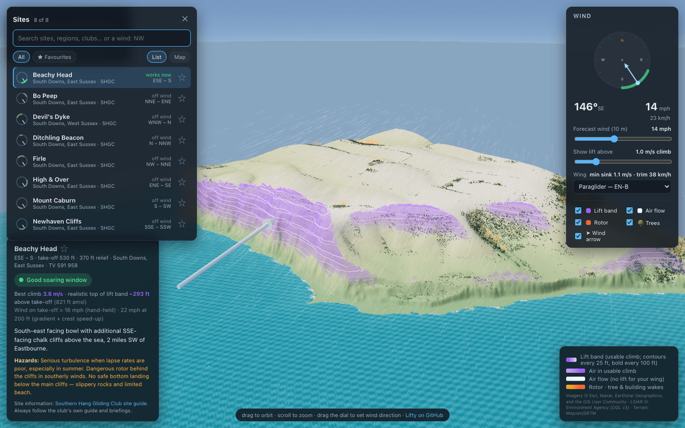
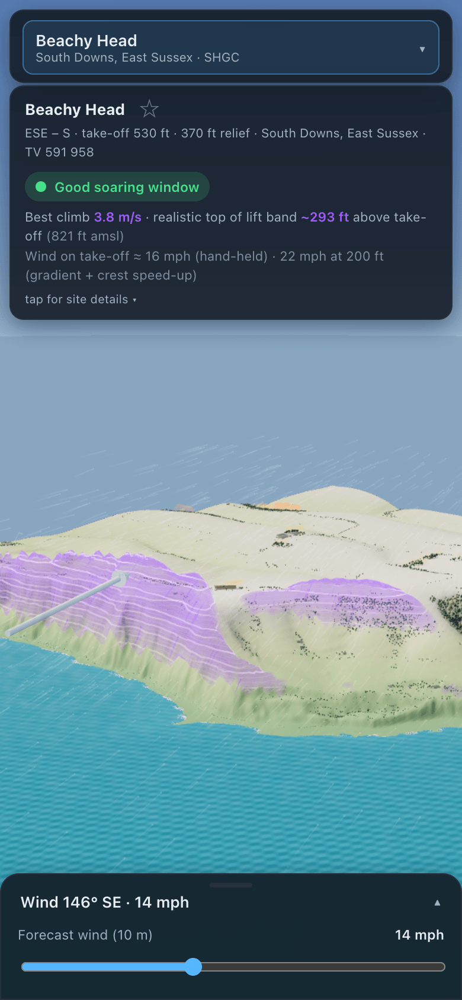
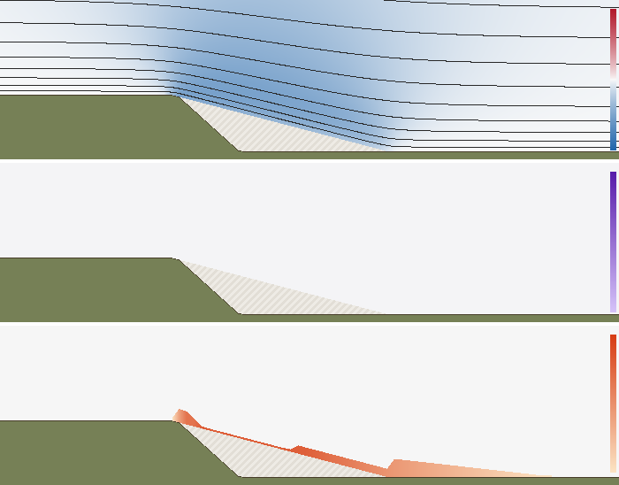

<p align="center"></p>

<h1 align="center">Lifty</h1>

<p align="center">
  <b>See where the ridge lift and rotor are at a paragliding site, for any wind.</b><br />
  Real LiDAR terrain, trees and buildings · a physics model of the airflow · runs in the browser
</p>

<p align="center">
  <a href="https://shgc-paragliding-sites.nick-4f5.workers.dev"><b>Open the app →</b></a> ·
  <a href="#adding-a-site">Add a site</a> ·
  <a href="CONTRIBUTING.md">Contribute</a> ·
  <a href="docs/PHYSICS.md">How the physics works</a> ·
  <a href="https://github.com/lukaville/lifty">GitHub</a>
</p>

<p align="center"></p>

## What it does

Pick a site and set the wind with the compass and slider. The 3D view shows:

- the **lift band**: where your wing can actually gain height. That's the updraught minus your
  sink rate at the speed you need to hold position, not just "where the air goes up";
- **rotor and turbulence** behind hills, and behind the tree lines and buildings detected from
  LiDAR;
- **air flow** as streaks of air parcels, coloured by what your wing would feel;
- a traffic-light **status** against the site's working-wind arc and strength band, plus the
  best climb, the ceiling in pure ridge lift, and the wind on take-off and at 200 ft.

It works on phones too. Sites can be searched, starred as favourites and browsed on a map.

<p align="center">
  
  &nbsp;
  
</p>

> [!WARNING]
> **An educational visualisation, not a flying authority.** It's a physics model of steady wind
> over terrain. It doesn't know about thermals, gusts, sea breezes, convergence or stability, so
> it under-predicts a thermic day and over-predicts a stable one. Always fly to the site's club
> guide, the actual conditions and a qualified coach.

## Sites

The app ships with the eight sites of the **Southern Hang Gliding Club** on the South Downs.
Their site information comes from the [SHGC site guide](https://shgc.org.uk/siteguide), and each
site credits its source in the app.

| Site | Working wind | Take-off / relief | Character |
|------|--------------|-------------------|-----------|
| Devil's Dyke | WNW–N | 700 ft / 500 ft | NW ridge → N bowl → 2-mile ridge |
| Firle | NW–NNE | 540 ft / 320 ft | N-facing bowl |
| Mount Caburn | S–SW | 500 ft / 420 ft | Isolated SW-facing dome |
| Beachy Head | ESE–S | 530 ft / 370 ft | SE bowl + chalk sea cliffs |
| Ditchling Beacon | N–NNW | 720 ft / 550 ft | N-facing bowl, long ridges |
| Bo Peep | NNE–ENE | 600 ft / 300 ft | NE ridge + bowls |
| High & Over | ENE–SE | 250 ft / 220 ft | Small steep E bowl (Cuckmere) |
| Newhaven Cliffs | SSE–SSW | 180 ft / 160 ft | S-facing sea cliffs |

### Adding a site

New sites are very welcome, from anywhere. In short:

1. Add an entry to [`public/data/sites.json`](public/data/sites.json): name, take-off
   coordinates, working-wind arc, strength band, hazards, and the club guide it comes from.
2. Build its data:
   ```bash
   node scripts/fetch-terrain.mjs <slug>
   node scripts/fetch-surface.mjs <slug>
   ```
   - **In England** this uses the Environment Agency's 1 m LiDAR, including trees and buildings.
   - **Elsewhere** it uses global ~30 m elevation data.
3. Check the lift band looks right, run the tests, and open a pull request.

The full walkthrough, with the field reference and a checklist, is in
[CONTRIBUTING.md → Adding a site](CONTRIBUTING.md#adding-a-site). If you'd rather not touch
code, [open a "new site" issue](../../issues/new?template=new-site.yml) with the details.

## Quick start

Requires **Node 22+**. There's no build step.

```bash
npm install
npm run serve        # http://127.0.0.1:8123
npm test             # unit, physics, data, simulation and browser tests
```

**Controls:** drag to orbit, scroll to zoom, drag the compass to set the wind direction, and
press <kbd>/</kbd> to search sites.

**Deep links:** `?site=beachy-head&dir=150&mph=12&lift=1&wing=hg` opens that site and wind.
The URL always carries the current site, so you can share it.

## How it works

- **Terrain, trees and buildings** come from 1 m Environment Agency LiDAR, where available, and
  satellite imagery. Every pixel is classified as open ground, bush, tree or building, and
  cliff-face artefacts are rejected. See [docs/DATA.md](docs/DATA.md).
- **Ridge lift** is a linear potential-flow solution over the real terrain, solved with FFTs in
  about 100 ms. It is refined with:
  - terrain-following heights, validated against exact potential flow;
  - a log-law wind gradient and Jackson–Hunt near-surface speed-up;
  - the air over the sea following the sea surface, not the seabed.
- **What counts as lift** depends on your wing: the updraught minus its sink at the speed needed
  to hold position, with an allowance for turns and terrain clearance. A usable-climb threshold
  is adjustable in the app.
- **Rotor** is an empirical model from published hill and step measurements. It isn't solved
  flow, which would need turbulence-resolving CFD. The separation-bubble length depends on lee
  steepness, followed by a recovering wake. Trees and buildings shed wakes to about 10× their
  height.
- **Rendering** is three.js: satellite-draped terrain, instanced 3D trees and buildings, a water
  shader, and the lift band drawn as a translucent contoured lens. See
  [docs/ARCHITECTURE.md](docs/ARCHITECTURE.md).

The full derivation, the validation, and what is not modelled are in
[docs/PHYSICS.md](docs/PHYSICS.md).

## Contributing

Bug reports, site additions, physics review and code are all welcome. See
[CONTRIBUTING.md](CONTRIBUTING.md). If you work with a coding agent, point it at
[AGENTS.md](AGENTS.md).

The project is tested at four layers:
- unit and physics tests on synthetic hills with known answers;
- golden per-site numbers;
- pixel-compared cross-sections of the wind simulation itself;
- Playwright tests of the app on desktop and phone, including screenshots.

<p align="center"><br /><sub>One of the 14 simulation cross-sections under test: an escarpment with the wind blowing off the edge.</sub></p>

## Credits and licences

The code is released under the [MIT licence](LICENSE). The data and services it uses have their
own terms:

| What | Source | Licence / terms |
|---|---|---|
| Site information | each site's club guide, credited in the app. Bundled sites: [Southern Hang Gliding Club](https://shgc.org.uk/siteguide) | © the respective club |
| Terrain, trees and buildings (England) | Environment Agency LiDAR composite DTM / first-return DSM, 1 m | © Environment Agency, [Open Government Licence v3.0](https://www.nationalarchives.gov.uk/doc/open-government-licence/version/3/) |
| Elevation (elsewhere, and the sea floor) | Mapzen/Tilezen Terrarium tiles, AWS Open Data (SRTM and others) | [attribution](https://github.com/tilezen/joerd/blob/master/docs/attribution.md) |
| Satellite imagery | Esri World Imagery (Clarity), © Esri, Maxar, Earthstar Geographics and the GIS User Community | streamed at runtime and not redistributed; only the derived landcover is stored |
| Map | © OpenStreetMap contributors | [ODbL](https://www.openstreetmap.org/copyright) |
| Libraries | three.js (MIT), Leaflet (BSD-2-Clause), vendored under `public/vendor/` | |

The screenshots in this repository are rendered without satellite imagery (`scripts/make-images.mjs`).

Source code: [github.com/lukaville/lifty](https://github.com/lukaville/lifty).
