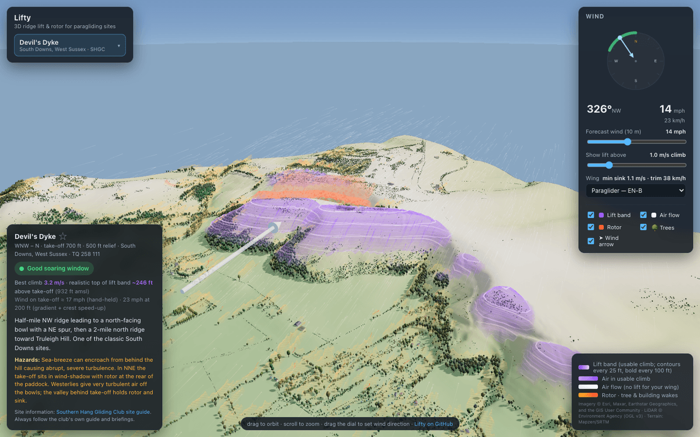

<p align="center"></p>

<h1 align="center">Lifty</h1>

<p align="center">
  <b>See where the ridge lift and rotor are at a paragliding site, for any wind.</b><br />
  <a href="https://liftyapp.pages.dev">Open the app</a> ·
  <a href="docs/PHYSICS.md">How it works</a> ·
  <a href="CONTRIBUTING.md">Contribute</a>
</p>

<p align="center"></p>

Pick a site and set the wind. Lifty models the airflow over the real terrain and shows:
- the band where your wing can gain height;
- rotor behind hills, trees and buildings;
- how the site suits the current wind.

It runs entirely in the browser, on desktop and phone.

> [!WARNING]
> An educational model of steady wind over terrain, not a flying authority. It ignores thermals,
> gusts, sea breezes and stability. Always follow the club's site guide, the actual conditions
> and a qualified coach.

## Quick start

Requires Node 22+. There's no build step.

```bash
npm install
npm run serve    # http://127.0.0.1:8123
npm test
```

## Docs

- [How the physics works](docs/PHYSICS.md): lift, wind gradient, rotor, and what isn't modelled.
- [Data pipeline](docs/DATA.md): terrain, trees and buildings from LiDAR and imagery.
- [Architecture](docs/ARCHITECTURE.md): code layout, URL options, deployment.
- [Contributing](CONTRIBUTING.md), including **[adding a site](CONTRIBUTING.md#adding-a-site)**.
  Or [propose a site in an issue](../../issues/new?template=new-site.yml).
- [Guide for coding agents](AGENTS.md).

## Credits

Code: [MIT](LICENSE). Bundled sites: [Southern Hang Gliding Club](https://shgc.org.uk/siteguide).
Terrain: © Environment Agency LiDAR ([OGL v3](https://www.nationalarchives.gov.uk/doc/open-government-licence/version/3/)) and Mapzen Terrarium.
Imagery: © Esri, Maxar, Earthstar Geographics (streamed, not redistributed).
Map: © [OpenStreetMap](https://www.openstreetmap.org/copyright) contributors.
Libraries: three.js, Leaflet.
